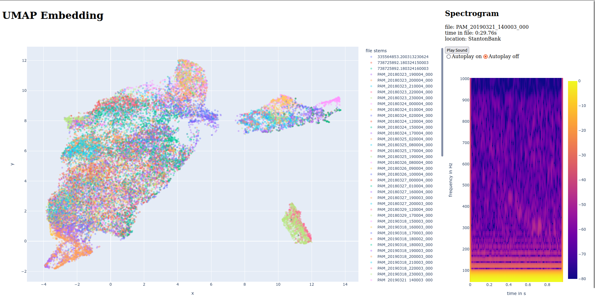
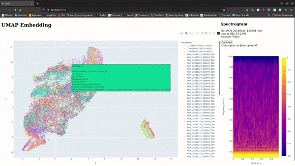

# **inemviz** - **in**teractive **em**bedding **vi**suali**z**ation

## Combine UMAP and interactive Visualizations to explore large datasets

inemviz uses plotly's dash library to provide an interactive visualization for your dataset.

<!--  -->

UMAP code provided by [@avery-b](https://github.com/avery-b)

Production is still in early stage, ease of use will hopefully increase in the next months.